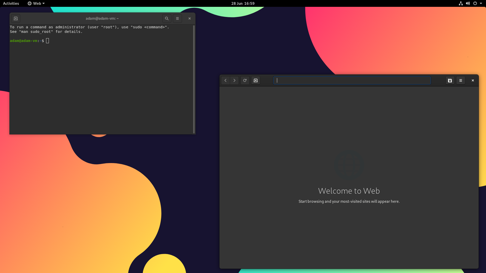
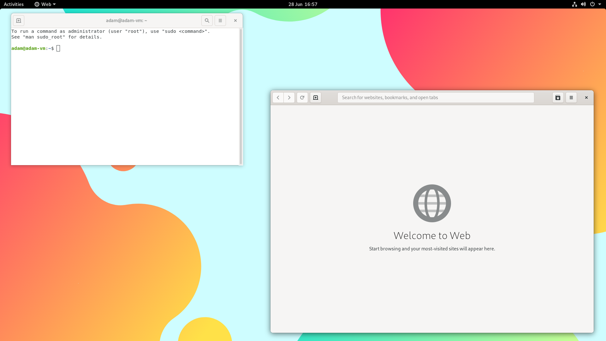
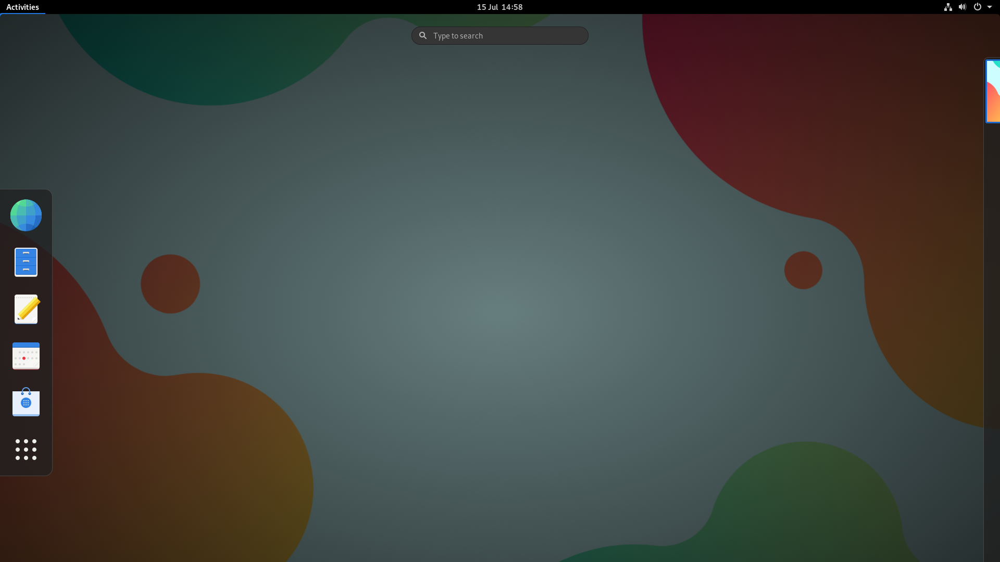

<center></center>

# CelOS - A simple, easy-to-use, flatpak centric Linux distribution for everyone. 
https://celos.cobweb-aclevo.org

CelOS is a simple, easy-to-use, flatpak centric Linux distribution for everyone based on Ubuntu 20.04 

`CelOS 1-beta6`

Last ISO release: 22nd July 2021

# Table of Contents
- [How to recreate CelOS & Our package list](#recreate-celos-our-package-list)
  - [Based on Ubuntu (20.04 LTS)](#ubuntu-based)
  - [Kernel 5.8.0-59-generic](#kernel)
  - [Repositories added (Apt)](#repo-add)
  - [(Apt) Packages that we have modified, removed or added](#package-modified)
  - [Repositories added (Flatpak)](#repo-add-flatpak)
  - [Flatpak Packages that we have modified (\*\*), removed (-) or added (+) - Including dependancies](#repo-mod-flatpak)
  - [Scripts and Files](#scripts)
  - [Wallpapers](#wallpapers)
  - [Themes](#themes)
  - [Icons](#icons)
  - [Plymouth Theme](#p-theme)
  - [Ubiquity slideshow](#slide)
  - [Others](#other)
  - [How can I re-create CelOS 1?](#recreate)
- [Made with love by Cob:web-Aclevo and our Open source contributors](#love)
- [Discord](#discord)
- [Screenshots](#screenshot)

# How to recreate CelOS & Our package list <a id="recreate-celos-package-list"></a>

Free and open source software is at the heart of Cob:web-Aclevo, and so we are going to ensure that all of the packages, scripts and tools provided pre and post installation are open source, free and findable. CelOS is licensed under the GPL3 license so you can copy, re-create, redistribute and contribute to CelOS!

## Based on Ubuntu (20.04 LTS) <a id="ubuntu-based"></a>

CelOS, at it's fundementals, is very heavily based on Ubuntu, we will be using a large majority of Ubuntu's packages unless we have specified whether or not we have removed, replaced, modified or added new packages (and their dependancies).

## Kernel 5.8.0-59-generic <a id="kernel"></a>

We are using the same Kernel that Ubuntu 20.04 LTS uses. People on older builds can still receive Kernel updates through upstream and so we will try to ensure that this is kept up-to-date.

## Repositories added (Apt): <a id="repo-add"></a>
Added universe

## (Apt) Packages that we have modified, removed or added [see here]() <a id="package-modified"></a>

## Scripts and files <a id="scripts"></a>

/etc/skel/ is a directory where items will be placed in your "home" directory post install

.bashrc -> /etc/skel

gnome-initial-setup-done -> /etc/skel/.config/

Wallpapers have been placed in -> /etc/skel/Pictures/ (~/Pictures)

## Wallpapers: <a id="wallpapers"></a>
Wallpapers have been placed in both /usr/share/backgrounds and ~/Pictures/

You can find the folder for our Wallpapers in the repository.

## Themes <a id="themes"></a>

We are using the default GTK and Shell theme for GNOME, "Adwaita"
https://gitlab.gnome.org/GNOME/gtk/tree/master/gtk/theme/Adwaita

## Icons: <a id="icons"></a>

We are using the "Adwaita icon theme" icon theme
https://gitlab.gnome.org/GNOME/adwaita-icon-theme

## Plymouth Theme <a id="p-theme"></a>

We are using a modified version of the Weyll-logo theme, which can be found on our GitHub

Original theme: https://www.gnome-look.org/p/1000034/

Once this theme has been placed in /usr/share/plymouth you need to run some commands to update initramfs;

```
update-alternatives --install /usr/share/plymouth/themes/default.plymouth default.plymouth /usr/share/plymouth/themes/weyll-logo/weyll-logo.plymouth 200
update-alternatives --set default.plymouth /usr/share/plymouth/themes/weyll-logo/weyll-logo.plymouth
update-initramfs -u
update-grub
apt update && apt upgrade
```

## Ubiquity slideshow <a id="slide"></a>

We have modified Ubiquity to display text and images for CelOS rather than Ubuntu. The files we have used are here:

https://github.com/Cobweb-Development/celos/tree/main/Assets/ubiquity-slideshow - /usr/share/ubiquity-slideshow/

`/usr/share/ubuiqity-slideshow/` was given 777 permissions during this stage and removed after we have changed the files within `/usr/share/ubiquity-slideshow/`

## Others <a id="other"></a>

We have modified the file in "/usr/share/glib-2.0/schemas/10-ubuntu-settings.gschema.override" in order for our Adwaita Icons, Wallpaper, and Adwaita-dark shell theme to apply by default.

The Grub has been modified to say "CelOS 1 GNU/Linux", the "grub" folder in "Assets" has two files related to modifying grub.

The file called "grub" should be placed in `/etc/default`

The file called custom.cfg should be placed in `/boot/grub`

Along with this ubuntu.seed and grub.cfg were edited in the "seed" and "grub" pages of the Cubic editor.

The plymouth theme and GDM logo have been modified

/etc/os-release and /etc/lsb-release has been modified.

GDM was modified by using the default theme, to change it run `update-alternatives --config gdm3-theme.gresource`

A one-time startup script in the "Assets" folder called "apply-theme.sh" has been placed in `/etc/profile.d/`

## How can I re-create CelOS 1? <a id="recreate"></a>

If you are on an Ubuntu-based distribution we can recommend Cubic as a live-ISO editor, and what we are currently using to create the distribution via a chroot environment.
https://launchpad.net/cubic

# Made with love by Cob:web-Aclevo and our Open source contributors: <a id="love"></a>

[whyAdamSalt](https://github.com/whyAdamSalt) - Lead Developer

Rany2 (GitHub) - Contributing a bug fix so that /etc/profile.d/ does not require 777 permissions

! NOT-Guillem#8042 (Discord) - Contributing 2 wallpapers

### Please join the Cob:web-Aclevo discord to talk to us and contribute to our projects: https://discord.gg/z3GXvGtuek <a id="discord"></a>

# Screenshots: <a id="screenshot"></a>
- Screenshots are from CelOS 1-beta5

<center></center>

- Default login screen for CelOS 1

<center></center>

- CelOS with Dark theme (default) + Default wallpaper

<center></center>

- CelOS activities overview + Default wallpaper

<center></center>

- CelOS with Light theme + Alternate wallpaper

<center></center>

- CelOS activities overview + Alternate wallpaper
